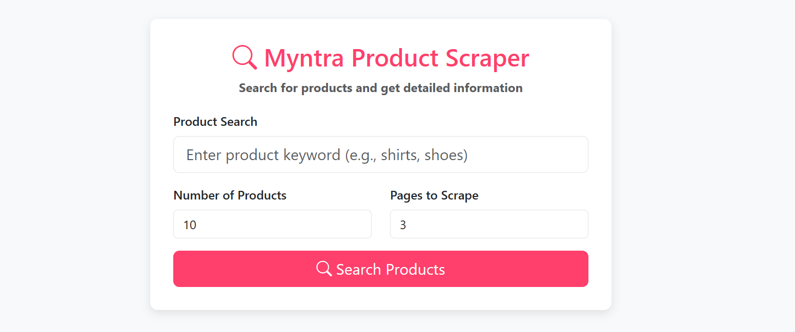
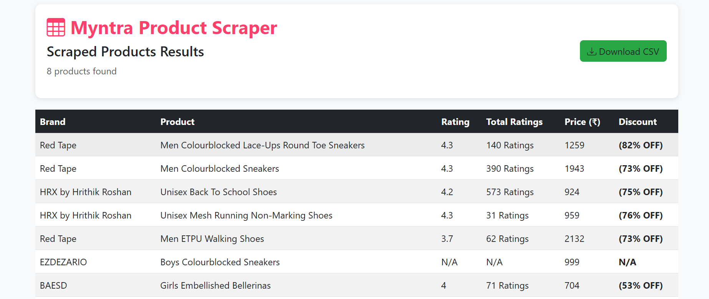

# Myntra Product Scraper Web Application



**A Flask-based web application that scrapes product data from Myntra.com based on user search queries, with real-time progress tracking and clean results display.**

# The output Interface



## Features

- Search for products by keyword
- Control the number of products and pages to scrape
- Real-time progress tracking with progress bar
- Clean tabular display of results
- Error handling and user-friendly messages
- Responsive design for all devices

## Technologies Used

- Python 3.x
- Flask (Backend framework)
- Selenium (Web scraping)
- Pandas (Data processing)
- Bootstrap 5 (Frontend styling)
- JavaScript (Progress updates)

## Prerequisites
- Python 3.7 or higher
- Google Chrome browser
- ChromeDriver (automatically installed by webdriver-manager)


# Clone repository
```bash
  git clone https://github.com/abuawaish/myntra-scraper.git
  cd myntra-scraper
```

# Create virtual environment
```bash
  python -m venv venv
  venv\Scripts\activate
```

# Install dependencies
pip install -r requirements.txt

```text
myntra-scraper/
├── app.py                 # Flask application
├── requirements.txt       # Dependencies
├── static/                # Static files (CSS, JS, images)
├── templates/             # HTML templates
│   ├── index.html         # Search page
│   ├── progress.html      # Progress tracking page
│   └── results.html       # Results display page
├── .gitignore             # Ignoring the unwanted files and folders.  
└── README.md              # Project documentation
```

# How to Run

1. Start the Flask application:
```bash
  python app.py
```
2. Open your web browser and navigate to:
```bash
  http://localhost:5000
```
3. Enter your search query, set the desired limit and pages, then click "Search Products"

4. View the progress page while scraping occurs

5. See the results displayed in a clean table format when complete

# Legal Considerations
**⚠️ Important: Web scraping may violate `Myntra's` terms of service. This project is for educational purposes only. Always:**

- Check robots.txt (https://www.myntra.com/robots.txt)

- Respect crawl delays

- Don't overload servers

- Use official APIs when available